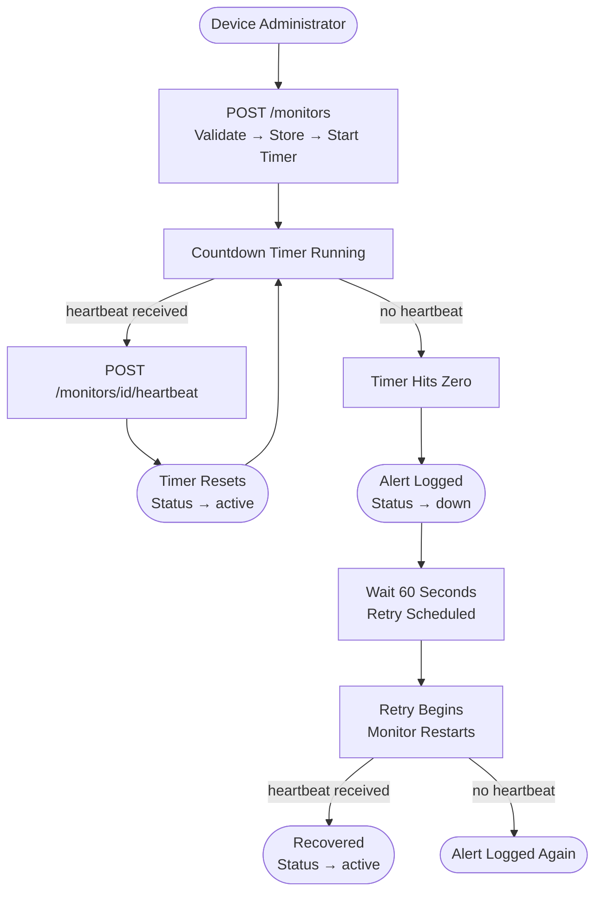

# Pulse Check API

A backend API built to monitor remote devices by tracking their heartbeats. When a device stops sending signals, the system automatically logs an alert.

---

## Architecture Diagram



---

## How It Works

```
Device registers → Timer starts → Device sends heartbeat → Timer resets

If no heartbeat is received:
Timer hits zero → Alert logged → Status set to "down" → Waits 60s → Retries automatically
```

---

## Setup

Make sure Python is installed, then run:

```bash
pip install flask
python app.py
```

Server starts at `http://127.0.0.1:5000`

---

## Endpoints

### Register a Monitor
**POST** `/monitors`

```json
{
  "id": "device-123",
  "timeout": 60,
  "timeout_unit": "seconds",
  "alert_email": "admin@critmon.com"
}
```

`timeout_unit` accepts: `seconds`, `minutes`, `hours`, `days`, or `weeks`

Response:
```json
{
  "message": "Monitor for device-123 created.",
  "timeout": "60 seconds",
  "status": "active"
}
```

---

### Send a Heartbeat
**POST** `/monitors/<id>/heartbeat`

Resets the timer. If the monitor was paused or down, this brings it back to active.

Response:
```json
{
  "message": "Heartbeat received. Timer reset.",
  "status": "active",
  "next_expected_in": "60 seconds"
}
```

---

### Pause a Monitor
**POST** `/monitors/<id>/pause`

Stops the timer so no alerts fire during planned maintenance.

Response:
```json
{
  "message": "Monitor 'device-123' paused. No alerts will fire.",
  "status": "paused"
}
```

Sending a heartbeat to a paused monitor automatically unpauses it and restarts the timer.

---

### Get a Single Monitor
**GET** `/monitors/<id>`

Response:
```json
{
  "id": "device-123",
  "status": "active",
  "timeout": "60 seconds",
  "alert_email": "admin@critmon.com"
}
```

---

### List All Monitors
**GET** `/monitors`

Response:
```json
{
  "total": 2,
  "monitors": [
    { "id": "device-123", "status": "active", "timeout": "60 seconds", "alert_email": "admin@critmon.com" },
    { "id": "device-456", "status": "down", "timeout": "2 hours", "alert_email": "ops@critmon.com" }
  ]
}
```

---

## Alert Behavior

When a device misses its heartbeat, the following is logged to the terminal and saved to `pulse_check.log`:

```
2026-05-24 10:45:00 [WARNING] ALERT - Device 'device-123' is DOWN!
```

The monitor status is then set to `down` and a retry is scheduled after 60 seconds.

---

## Additional Features

**Email validation** — the API checks that the `alert_email` provided is a valid email address before registering a monitor.

**Flexible time units** — timeouts can be set in `seconds`, `minutes`, `hours`, `days`, or `weeks` instead of only seconds.

**Active status on heartbeat** — every successful heartbeat response includes `"status": "active"` to confirm the device is healthy.

**Retry logic** — after a device goes down, the system waits 60 seconds and restarts the monitor automatically to check if the device recovers.

**Log file** — all activity is written to `pulse_check.log` so there is a permanent record of events even if the server restarts.

---

## Developer's Choice

I added `GET /monitors/<id>` and `GET /monitors` as my developer's choice features. A monitoring system needs a way to check the current state of devices at any point in time. These endpoints allow engineers to view the status of a single device or all registered devices without having to wait for an alert to fire.